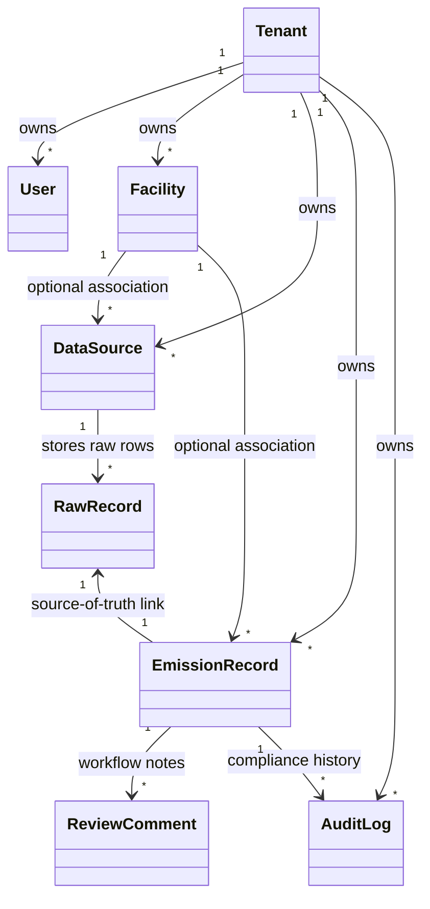
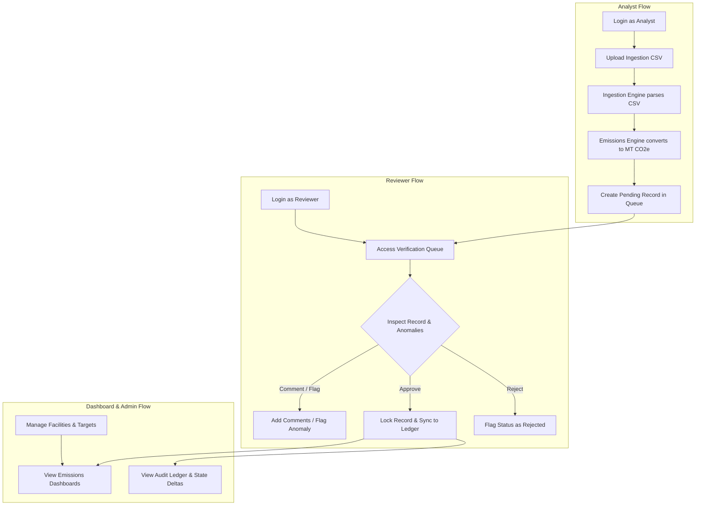

# Terralyt (Breathe ESG)

Terralyt is a multi-tenant Enterprise ESG (Environmental, Social, and Governance) management system designed to track, calculate, audit, and report greenhouse gas (GHG) emissions. The system allows organizations to import diverse consumption data, execute automated carbon footprint conversions based on international protocols, and verify records within a secured auditor review queue.

This repository contains both the **Django REST API Backend** and the **React + TypeScript Frontend**.


---

## Project Structure

```text
Terralyt/
├── docs/                     # Architectural documents (MODEL.md, DECISIONS.md, etc.)
├── sources/                  # Directory containing template CSV files
├── backend/                  # Django backend workspace
│   ├── audit/                # Security activity ledgers and delta state captures
│   ├── backend/              # Core Django configurations
│   ├── emissions/            # Carbon calculations and dashboards
│   ├── ingestion/            # Data sources and CSV raw parsing logs
│   ├── review/               # Verification workflows and auditing queues
│   ├── tenants/              # Multi-tenant definitions and custom users
│   ├── manage.py             # Django command-line execution entrypoint
│   └── requirements.txt      # Python dependencies list
└── frontend/                 # Frontend Vite React workspace
    ├── src/                  # React components and client logic
    ├── package.json          # Node dependencies list
    └── vite.config.ts        # Vite build tool configuration
```

---

## Key Features

### Backend (Django)
* **Secure Authentication** - Custom email-based user registration, login, and Role-Based Access Control (RBAC) with user role permissions.
* **Ingestion Pipelines** - Ingest and archive raw CSV data streams from SAP, Utility bills, and Travel agencies into isolated JSON raw records.
* **Emissions Engine** - Automated conversion of raw quantities to metric tons CO2-equivalent based on scope and activity coefficients.
* **Verification Workflow** - Core Reviewer portal allowing users to comment on records, flag consumption anomalies, and lock records from future edits.
* **Continuous Auditing** - Append-only activity log ledger capturing snapshots of old and new data values.
* **Database Isolation** - Enforcement of strict tenant isolation bounds at the database level across all tables.

### Frontend (React + TypeScript)
* **Interactive Dashboards** - Visualize carbon footprint metrics, GHG scopes (Scope 1, 2, and 3), facility breakdowns, and reduction targets.
* **Upload Center** - Analyst drag-and-drop workspace to upload CSV data spreadsheets and monitor real-time ingestion status logs.
* **Review Verification Queue** - Reviewer dashboard to audit pending entries, examine anomalies, submit comments, and approve/reject records.
* **Facility Management** - Admin registry workspace to map and manage physical facilities, warehouses, and offices.
* **Audit Ledger** - Compliance view displaying system activity trails and delta comparisons (old vs. new values).
* **Target Settings** - Adjust baseline years, target reduction percentages, and emissions standards.

---

## Tech Stack

| Component | Technology Badges | Description |
|---|---|---|
| **Frontend** |       | Single-Page Application (SPA) client interface |
| **Backend** |     | Relational database backend, REST APIs, WSGI server via Gunicorn |

---

## Getting Started

### Prerequisites
* **Python (v3.12+)** (for backend)
* **Node.js (v18+)** and **npm** (for frontend)
* **Git**

---

### Backend Setup

1. Navigate to the `backend` folder:
   ```bash
   cd backend
   ```

2. Create and activate a virtual environment:
   ```bash
   python -m venv venv
   source venv/bin/activate  # On Windows: venv\Scripts\activate
   ```

3. Install dependencies:
   ```bash
   pip install -r requirements.txt
   ```

4. Create a `.env` file in the `backend/` directory:
   ```env
   SECRET_KEY=your_django_secret_key
   DJANGO_DEBUG=True
   DATABASE_URL=sqlite:///db.sqlite3
   ALLOWED_HOSTS=localhost,127.0.0.1
   CORS_ALLOWED_ORIGINS=http://localhost:5173
   ```

5. Run database migrations and start the server:
   ```bash
   python manage.py migrate
   python manage.py runserver
   ```

   The backend will be available at `http://localhost:8000`.

---

### Frontend Setup

1. Open a new terminal and navigate to the `frontend` folder:
   ```bash
   cd frontend
   ```

2. Install dependencies:
   ```bash
   npm install
   ```

3. Create a `.env` file in the `frontend/` directory:
   ```env
   VITE_API_URL=http://localhost:8000
   ```

4. Run the development server:
   ```bash
   npm run dev
   ```

   The web app will be available at `http://localhost:5173`.

---

## Testing

### Backend
Run Python unit/integration tests from the `backend/` directory:
```bash
python manage.py test
```

### Frontend
Run frontend component tests from the `frontend/` directory:
```bash
npm run test
```

---

## Documentation & Architecture

### System Architecture
The following class diagram represents the logical relationships and tenant boundary constraints across the application database models:



### User Flow
The following flowchart illustrates the end-to-end user flow within the Terralyt application, showing how data transitions from raw ingestion to reviewer verification and dashboard reporting:



For deeper details on the core structures, design models, and system capabilities, refer to:
* **[MODEL.md](docs/MODEL.md)** - Details on database models, relationships, and custom fields.
* **[SOURCES.md](docs/SOURCES.md)** - Raw ingestion formats, data sources, and normalization details.
* **[DECISIONS.md](docs/DECISIONS.md)** - Key architectural design decisions and assumptions.
* **[TRADEOFFS.md](docs/TRADEOFFS.md)** - Technical trade-offs, shortcuts, and future enhancement paths.

---

## License & Contact

This project is licensed under the MIT License.

For questions or collaboration opportunities, feel free to reach out:
* **Contact**: Khalid Shaikh (shk.khalid18@gmail.com)
