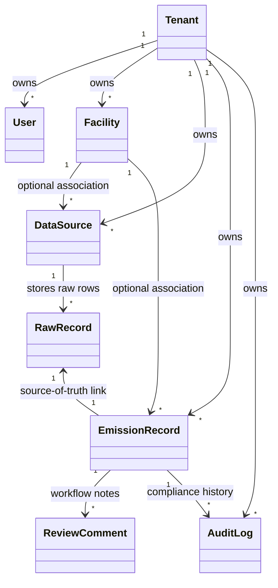

# Terralyt Backend

Terralyt is a multi-tenant Enterprise ESG (Environmental, Social, and Governance) management system designed to track, calculate, audit, and report greenhouse gas (GHG) emissions. The system allows organizations to import diverse consumption data, execute automated carbon footprint conversions based on international protocols, and verify records within a secured auditor review queue.

  
  
  

---

## Key Features

* **Secure Authentication** - Custom email-based user registration, login, and Role-Based Access Control (RBAC) with user role permissions.
* **Ingestion Pipelines** - Ingest and archive raw CSV data streams from SAP, Utility bills, and Travel agencies into isolated JSON raw records.
* **Emissions Engine** - Automated conversion of raw quantities to metric tons CO2-equivalent based on scope and activity coefficients.
* **Verification Workflow** - Core Reviewer portal allowing users to comment on records, flag consumption anomalies, and lock records from future edits.
* **Continuous Auditing** - Append-only activity log ledger capturing snapshots of old and new data values.
* **Database Isolation** - Enforcement of strict tenant isolation bounds at the database level across all tables.

---

## Live Demo

Experience the live API: [Terralyt Backend](https://breatheesg-backend-tnlv.onrender.com)

---

## Tech Stack

* **Django** (5.2.14) - Core Python web application framework.
* **Django REST Framework** (3.17.1) - REST API construction and routing toolkit.
* **PostgreSQL / SQLite** - Relational databases managed via `dj-database-url`.
* **Gunicorn** (26.0.0) - Production-ready WSGI web server.
* **Requests** (2.34.2) - Local and external service query communications.

---

## Folder Structure

```text
Terralyt/
├── docs/                     # Architectural documents (MODEL.md, DECISIONS.md, etc.)
├── sources/                  # Directory containing template CSV files
├── backend/                  # Django backend workspace
│   ├── audit/                # Security activity ledgers and delta state captures
│   │   ├── models.py         # AuditLog model definition
│   │   ├── views.py          # Audit log list views
│   │   └── serializers.py    # Snapshot value serializers
│   ├── backend/              # Core Django configurations (settings, urls)
│   ├── emissions/            # Carbon calculations and dashboards
│   │   ├── models.py         # EmissionRecord model and calculation logic
│   │   └── views.py          # Dashboard aggregates and details views
│   ├── ingestion/            # Data sources and CSV raw parsing logs
│   │   ├── models.py         # DataSource and RawRecord models
│   │   └── views.py          # File upload views
│   ├── review/               # Verification workflows and auditing queues
│   ├── tenants/              # Multi-tenant definitions and custom users
│   ├── manage.py             # Django command-line execution entrypoint
│   └── requirements.txt      # Python dependencies list
└── frontend/                 # Frontend Vite React workspace
```

---

## Getting Started

### Prerequisites

* **Python (v3.12+)** - Required to run the Django application.
* **virtualenv** or **venv** - For an isolated Python environment.

---

### Installation

1. Clone the repository and navigate to the backend folder:
   ```bash
   git clone https://github.com/shk-khalid/Terralyt.git
   cd Terralyt/backend
   ```

2. Create and activate a virtual environment:
   ```bash
   python -m venv venv
   source venv/bin/activate
   ```

3. Install dependencies:
   ```bash
   pip install -r requirements.txt
   ```

4. Run database migrations:
   ```bash
   python manage.py migrate
   ```

5. Run the development server:
   ```bash
   python manage.py runserver
   ```

---

## Environment Variables

To run this project, create a `.env` file in the backend root directory and add the following variables:

```env
SECRET_KEY=your_django_secret_key
DJANGO_DEBUG=True
DATABASE_URL=sqlite:///db.sqlite3
ALLOWED_HOSTS=localhost,127.0.0.1
CORS_ALLOWED_ORIGINS=http://localhost:5173
```

---

## API Integration

The frontend communicates with the backend via REST APIs. The primary API endpoints include:

### Authentication
* `POST /api/token/` - Obtain JWT access and refresh tokens.
* `POST /api/token/refresh/` - Refresh JWT access tokens.

### Ingestion & Sources
* `POST /api/ingestion/upload/` - Upload raw CSV files.
* `GET /api/ingestion/history/` - Retrieve upload history and logs.

### Emissions & Review Queue
* `GET /api/emissions/dashboard/` - Fetch carbon footprint analytics aggregates.
* `GET /api/review/queue/` - Access pending records for verification.
* `POST /api/review/records/{id}/approve/` - Approve and lock emission record.
* `POST /api/review/records/{id}/reject/` - Flag emission record as rejected.

---

## System Architecture

The following class diagram represents the logical relationships and tenant boundary constraints across the application database models:



For a comprehensive explanation of our design models, please refer to the detailed **[MODEL.md](../docs/MODEL.md)** documentation.

---

## Deployment

The project is configured for deployment using Gunicorn as the WSGI server:
```bash
gunicorn config.wsgi --log-file -
```
Ensure database connection parameters (`DATABASE_URL`) are configured inside production dashboards.

---

## Contributing

Contributions are welcome! Follow these steps:

1. Fork the repository.
2. Create a feature branch:
   ```bash
   git checkout -b feature/amazing-feature
   ```
3. Commit your changes:
   ```bash
   git commit -m "Add an amazing feature"
   ```
4. Push your branch:
   ```bash
   git push origin feature/amazing-feature
   ```
5. Open a Pull Request for review.

---

## Testing & Seeding

Unit and integration tests are handled using standard Django unit testing.

* Run backend unit tests:
  ```bash
  python manage.py test
  ```

---

## License

This project is licensed under the MIT License - see the LICENSE file for details.

---

## Contact

For questions or collaboration opportunities, feel free to reach out:

Khalid Shaikh - shk.khalid18@gmail.com
Project Repository: [Terralyt](https://github.com/shk-khalid/Terralyt.git)
